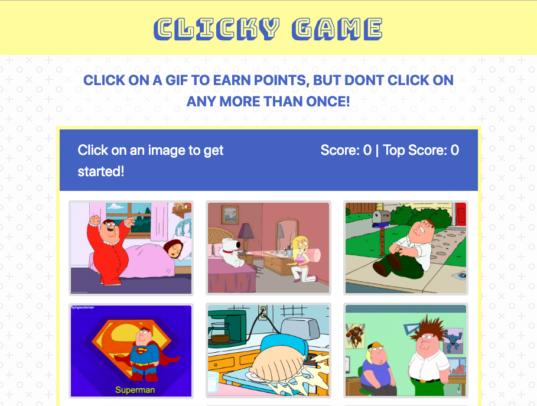

# Clicky-Game 

## How it works

Clicky-Game is a memory game created with Reactjs. The user is presented with 13 different gifs. The user must click a gif, one at a time, with out clicking the same gif twice. 

* The user's score goes up by 1 point every time they click on a gif they haven't clicked before
* Once the user clicks on a gif that they have already clicked on, the game ends and the score is reset to zero.
* To start the game over again, the user must simply click on a gif.
* After each game ends, The Clicky-Game keeps track of the Top Score of all the games previously played by the user.

### Play Now
https://willrackley.github.io/Clicky-Game/
